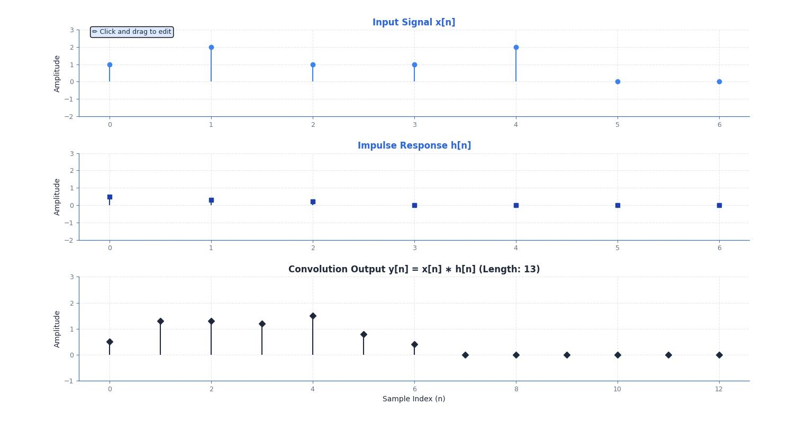
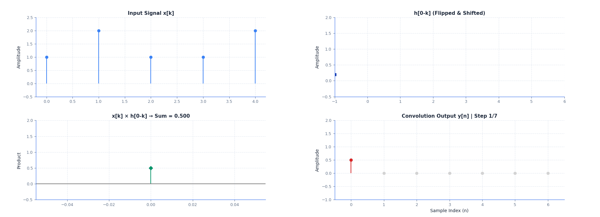

# DSP Convolution and Properties Visualization Suite

**A comprehensive interactive toolkit for understanding convolution and Linear Time-Invariant (LTI) systems.** This educational tool provides visual and mathematical insights into the fundamental concepts of Digital Signal Processing.

*Follows Section 2.3 of the textbook (Proakis and Manolakis, 4th ed.)*

## 🎥 Demo Video

### Complete Application Demonstration

<div align="center">

**Watch the DSP Convolution Visualization Suite in action:**

https://github.com/user-attachments/assets/901ccabe-8ac3-48af-94a2-02fd2286f258

*Experience the full interactive capabilities of both convolution viewers*

</div>

**Demo Highlights:**
- 🎮 **Real-Time Signal Editing**: Interactive click-and-drag signal modification
- ⚡ **Live Convolution Computation**: Instant visualization of y[n] = x[n] ∗ h[n]
- 🎬 **Step-by-Step Animation**: Mathematical breakdown of convolution process
- 🔬 **Property Verification**: Interactive demonstration of LTI system properties
- 🎯 **Educational Tools**: Signal templates, presets, and analysis features
- 💫 **Professional UI**: Clean, modern interface optimized for learning

---

## 🎬 Visual Demonstrations

### Real-Time Interactive Convolution Viewer

The main convolution viewer provides real-time visualization of discrete convolution with interactive signal editing capabilities:

<div align="center">



*Figure 1: Real-time convolution visualization with interactive signal editing*

</div>

**Key Features Shown:**
- 📊 **Input Signal x[n]**: Interactive stem plot with click-and-drag editing
- 🎛️ **Impulse Response h[n]**: System characteristic function 
- 📈 **Convolution Output y[n]**: Real-time computation showing y[n] = x[n] ∗ h[n]
- 📏 **Signal Properties**: Dynamic length computation (Length: 13 in this example)
- 🎮 **Interactive Controls**: Signal selection, templates, and manual input options

### Step-by-Step Animation Viewer

The step-by-step viewer demonstrates the mathematical process of convolution computation:

<div align="center">



*Figure 2: Animated step-by-step convolution computation process*

</div>

**Animation Features:**
- 🔢 **Progressive Computation**: Each frame shows one step of y[n] calculation
- 📐 **Mathematical Visualization**: Clear display of x[k] × h[n-k] products
- 🔄 **Flip-and-Slide Method**: Visual demonstration of h[n-k] transformation
- 📝 **Real-Time Equations**: Mathematical expressions update with each step
- ⏯️ **Animation Controls**: Play, pause, step-through, and speed adjustment

## 🎯 Project Overview

### 🌟 Why Convolution Visualization Matters?

Convolution is the cornerstone of signal processing because it:
- 📐 **Mathematical Foundation** - Provides the fundamental operation for LTI systems
- 🔍 **Visual Understanding** - Complex mathematical concepts become intuitive
- 🎓 **Educational Impact** - Students grasp abstract concepts through interaction
- 🔧 **Practical Relevance** - Forms the basis for filtering, image processing, and AI
- 🚀 **Real-Time Learning** - Immediate feedback enhances comprehension

## 📋 Learning Objectives & Content

### 🔧 Core Convolution Concepts

#### **Review of Impulse Response**
Understanding the fundamental system characterization:
- 🎯 **Definition**: h[n] as the system's complete characterization
- 📊 **Visualization**: How a system responds to unit impulse δ[n]
- 🎮 **Interactive Exploration**: Different impulse response shapes and effects

#### **Computing System Response - Multiple Approaches**

1. **📝 Direct Computation**
   - Manual calculation of convolution sum
   - Step-by-step mathematical evaluation
   - Understanding the fundamental definition: `y[n] = Σ x[k]h[n-k]`

2. **🔄 Convolution Sum Method**
   - Adding up shifted and scaled copies of impulse response
   - Visual representation of signal decomposition
   - Real-time visualization of weighted impulse responses

3. **🔀 Flip and Slide Method**
   - Flipping one signal against the other
   - Sliding window visualization
   - Understanding h[n-k] transformation mechanics

#### **Understanding h[n-k] Transformation**
- 🔄 **Signal Flipping**: Visual demonstration of h[n] → h[-k]
- ⏰ **Time-Shifting**: Interactive h[-k] → h[n-k] transformation
- 🎮 **Interactive Process**: Hands-on flip-and-slide exploration
- 📐 **Mathematical Insight**: Connection to convolution integral

### 🔧 Advanced Signal Processing

#### **Infinite-Length Signal Convolution**
- ∞ **Unbounded Sequences**: Handling infinite-length signals
- 📊 **Convergence Conditions**: Stability requirements
- 📐 **Sum of Finite Geometric Series**
  - Mathematical foundation: `Σ(ar^n) = a(1-r^N)/(1-r)` for |r| < 1
  - Applications in exponential signal analysis

### ⚖️ Properties of Convolution/LTI Systems

Interactive demonstrations of fundamental LTI system properties:

#### **1. 🔄 Commutative Property**
- **Mathematical**: `x[n] ∗ h[n] = h[n] ∗ x[n]`
- **Visual Proof**: Signal swapping demonstration
- **Understanding**: Input-system symmetry concept

#### **2. 📊 Distributive Property**
- **Mathematical**: `x[n] ∗ (h₁[n] + h₂[n]) = x[n] ∗ h₁[n] + x[n] ∗ h₂[n]`
- **Application**: Parallel system combination
- **Visualization**: Superposition principle in action

#### **3. 🔗 Associative Property**
- **Mathematical**: `(x[n] ∗ h₁[n]) ∗ h₂[n] = x[n] ∗ (h₁[n] ∗ h₂[n])`
- **Application**: Cascade system equivalence
- **Understanding**: System composition and decomposition

## 🚀 Quick Start

### Main Applications

```bash
# 🎮 Enhanced real-time interactive viewer
python convolution_viewer.py

# 🎬 Step-by-Step animation with detailed explanations
python convolution_step_by_step_viewer.py
```

### 📚 Visual Learning Examples

1. **🎨 Interactive Signal Design**: Use the real-time viewer to create and modify signals
2. **📐 Mathematical Understanding**: Follow step-by-step animation for computation insight
3. **🔬 Property Verification**: Test mathematical properties through visual comparison
4. **🎛️ System Analysis**: Analyze different impulse responses and their effects

### 🎓 Running Examples for Learning

1. **🔗 Start with Real-Time Viewer**: Explore basic convolution concepts
2. **🎬 Move to Step-by-Step Animation**: Understand the mathematical process
3. **⚖️ Experiment with Properties**: Test commutative, associative, distributive properties
4. **🔧 Analyze System Types**: Compare causal vs. non-causal, stable vs. unstable systems

## ✨ Features

### 🔗 Real-Time Convolution Viewer
- 📏 **Dynamic Signal Length**: Automatic adjustment based on input values
- 🎮 **Interactive Editing**: Click and drag to modify signal values in real-time
- 🎯 **Signal Templates**: Built-in generators for common signal types
- 📊 **Property Analysis**: Real-time computation of signal properties
- ✅ **Mathematical Verification**: Live demonstration of convolution properties

### 🎬 Step-by-Step Animation Viewer  
- 📐 **Visual Mathematics**: Step-by-step convolution computation with equations
- 🔄 **Flip-and-Slide Visualization**: Clear demonstration of h[n-k] transformation
- ⏯️ **Animation Controls**: Variable speed, pause, step-through capabilities
- 📊 **Progress Tracking**: Visual progress bar and mathematical explanations
- 💾 **Export Capabilities**: Save animations and plots for educational use

## 📊 Output Examples and Interpretations

### Example 1: Basic Convolution Demonstration

The provided image shows a typical convolution scenario:
- **📊 x[n]**: Input signal with impulse-like characteristics
- **🎛️ h[n]**: Impulse response of a discrete-time system
- **📈 y[n]**: Resulting convolution output with length = len(x) + len(h) - 1 = 13 samples

### Example 2: Step-by-Step Process Visualization

The animation demonstrates:
1. **🔄 Signal Flipping**: h[n] → h[-k] transformation
2. **⏰ Time Shifting**: h[-k] → h[n-k] for each output sample
3. **✖️ Product Formation**: Point-wise multiplication x[k] × h[n-k]
4. **➕ Summation**: Accumulation of products to form y[n]

### Understanding the Visuals

**🎨 Color Coding in Applications:**
- **🔵 Blue Signals**: Primary input signals (x[n], h[n])
- **🟢 Green/Dark**: Convolution output and intermediate products
- **🔴 Red Highlights**: Current computation step or active elements
- **📐 Grid Lines**: Reference for precise value reading

**📝 Mathematical Annotations:**
- Real-time equation display showing current computation
- Step indicators and progress tracking
- Signal property calculations (energy, length, extrema)

## 📊 Mathematical Foundation

### Discrete Convolution Definition
```
y[n] = x[n] ∗ h[n] = Σ x[k] · h[n-k]
                     k=-∞ to ∞
```

### Key Relationships
- **🎯 Impulse Response**: System output for δ[n] input
- **📈 Step Response**: s[n] = Σ h[k] from k=-∞ to n
- **⚖️ Stability Condition**: Σ |h[n]| < ∞ (absolutely summable)
- **⏰ Causality Condition**: h[n] = 0 for n < 0

## 🛠️ Installation

```bash
# Clone repository
git clone <repository-url>
cd DSP-3-Convolution-and-its-properties

# Install dependencies
pip install numpy matplotlib tkinter

# Run applications
python convolution_viewer.py
python convolution_step_by_step_viewer.py
```

## 🔧 Dependencies

```python
numpy>=1.21.0      # Numerical computing
matplotlib>=3.5.0  # Plotting and visualization  
tkinter>=8.6       # GUI framework (usually included)
```

## 💡 Usage Examples

### Example 1: Understanding Impulse Response
```python
# Set x[n] to unit impulse: [1, 0, 0, 0, ...]
# Set h[n] to your system impulse response
# Observe: y[n] = x[n] ∗ h[n] = h[n]
```

### Example 2: Step Response Analysis
```python
# Set x[n] to unit step: [1, 1, 1, 1, ...]
# Observe: y[n] is the cumulative sum of h[n]
# This demonstrates s[n] = Σ h[k] relationship
```

### Example 3: Property Verification
```python
# Test Commutative Property:
# 1. Compute y₁[n] = x[n] ∗ h[n]
# 2. Swap signals: compute y₂[n] = h[n] ∗ x[n]
# 3. Verify: y₁[n] = y₂[n]
```

## 🎓 Educational Scenarios

### Scenario 1: Moving Average Filter
- **🎛️ Impulse Response**: h[n] = [1/3, 1/3, 1/3]
- **🎯 Purpose**: Smoothing noisy signals
- **📊 Analysis**: Low-pass filtering characteristics

### Scenario 2: Exponential Decay System
- **🎛️ Impulse Response**: h[n] = aⁿu[n], |a| < 1
- **🎯 Purpose**: Modeling RC circuits, echo systems
- **📊 Analysis**: Stability and causality

### Scenario 3: Difference Equation Implementation
- **🔧 System**: y[n] = ay[n-1] + bx[n]
- **🎛️ Impulse Response**: h[n] = ba^n u[n]
- **📊 Analysis**: Recursive vs. non-recursive implementation

## 🏗️ Project Structure

```
DSP-3-Convolution-and-its-properties/
├── convolution_viewer.py                       # 🔗 Interactive real-time convolution viewer
├── convolution_step_by_step_viewer.py          # 🎬 Step-by-step animation viewer
├── README.md                                   # 📚 Comprehensive documentation
├── requirements.txt                            # 📦 Python dependencies
├── image.png                                   # 🖼️ Example output from main viewer
├── animation.gif                              # 🎬 Example step-by-step animation
└── demo_video.mp4                             # 🎥 Complete demonstration video
```

## 📈 Learning Outcomes

After completing this module, you will understand:

### **🎯 Theoretical Concepts**
- Mathematical definition and importance of convolution
- LTI system properties and their practical implications
- Connection between time-domain and frequency-domain analysis
- Foundation for advanced signal processing techniques

### **📐 Mathematical Skills**
- Step-by-step convolution computation methods
- Property verification through mathematical proof
- Signal analysis and system characterization
- Understanding of impulse response significance

### **🔧 Practical Applications**
- Real-time signal processing implementation
- Interactive system design and analysis
- Visual interpretation of mathematical concepts
- Performance evaluation of processing systems

## 🎓 Connection to Course Material

This project implements concepts from **Section 2.3** of the standard DSP textbook (Proakis and Manolakis, 4th ed.), providing:

- **📚 Theoretical Foundation** with rigorous mathematical treatment
- **💻 Practical Implementations** with working Python code
- **👁️ Visual Demonstrations** of key concepts
- **🔬 Hands-on Experiments** to reinforce learning

## 🔮 What's Next?

This foundation prepares you for advanced DSP topics:
- **🔄 Z-Transform** analysis of LTI systems
- **📊 Frequency Response** design and analysis
- **🎛️ Digital Filter Design** techniques
- **🖼️ Image Processing** applications
- **🤖 Machine Learning** signal processing

## 🤝 Contributing

Enhance this educational resource by adding:
1. **🎛️ New System Examples** (high-pass filters, differentiators, etc.)
2. **🎮 Interactive Features** for enhanced learning
3. **📊 Analysis Tools** for system characterization
4. **🌍 Real-World Applications** of convolution

## 📄 License

This educational software is designed for academic use in Digital Signal Processing courses. Free for educational and research purposes.

---

**DSP Convolution and Properties Visualization Suite**  
**Author**: DSP Education Team  
**Course**: Digital Signal Processing Fundamentals  
**Textbook Reference**: Section 2.3 (Proakis and Manolakis, 4th ed.)
   - Signal manipulation and interaction
   - Immediate visual feedback

2. **Process Understanding** (Step-by-Step Viewer):
   - Mathematical step-by-step breakdown
   - Flip-and-slide methodology
   - h[n-k] transformation insights

3. **Property Exploration**:
   - Interactive property verification
   - Multiple computation methods
   - System analysis tools

4. **Advanced Applications**:
   - Filter design concepts
   - System identification
   - Stability and causality analysis

### Assessment Integration

The tools support various assessment methods:
- **Conceptual Questions**: Visual aids for theoretical understanding
- **Computational Problems**: Step-by-step solution verification
- **Design Projects**: Interactive filter and system design
- **Analysis Tasks**: Property verification and system characterization

## 📈 Learning Outcomes

Students using this toolkit will demonstrate:

1. **Visual Understanding**: Interpret convolution through graphical representations
2. **Mathematical Insight**: Connect visual animations to mathematical equations
3. **Interactive Learning**: Hands-on experience with signal manipulation
4. **Process Comprehension**: Step-by-step understanding of convolution computation
5. **Practical Application**: Real-world signal processing problem solving

The provided visual examples showcase how the tools transform abstract mathematical concepts into intuitive, interactive learning experiences.

## 🔧 Technical Implementation

### Enhanced Black & Blue Theme
- **Professional Appearance**: Dark theme optimized for technical presentations
- **High Contrast**: Excellent visibility in classroom environments
- **Color Coding**: Consistent signal identification across all views
- **Typography**: Clear, readable fonts for mathematical expressions

### Performance Optimizations
- **Dynamic Signal Length**: Efficient memory usage for varying signal sizes
- **Real-Time Updates**: Optimized plotting for interactive responsiveness
- **Smooth Animations**: Controlled frame rates for educational clarity
- **Resource Management**: Efficient matplotlib backend usage

### User Interface Design
- **Intuitive Controls**: Self-explanatory buttons and widgets
- **Progressive Disclosure**: Advanced features accessible when needed
- **Contextual Help**: Built-in guidance and status information
- **Cross-Platform**: Works on Windows, macOS, and Linux

## 🤝 Contributing and Extending

### For Educators
- **Custom Examples**: Easy addition of new signal types and scenarios
- **Assessment Tools**: Framework for creating interactive problems
- **Content Integration**: Seamless integration with course materials
- **Accessibility**: Support for various learning styles and abilities

### For Developers
- **Modular Design**: Clean separation of concerns for easy modification
- **Documented APIs**: Clear interfaces for extending functionality
- **Testing Framework**: Verification tools for new features
- **Version Control**: Git-friendly structure for collaborative development

## 📚 References and Further Reading

### Primary Textbook
**Proakis and Manolakis, "Digital Signal Processing: Principles, Algorithms, and Applications", 4th Edition, Section 2.3**

### Supplementary Materials
- Convolution properties and mathematical proofs
- LTI system theory and applications
- Discrete-time signal processing fundamentals
- System identification and analysis techniques

### Online Resources
- Interactive demonstrations and tutorials
- Problem sets with step-by-step solutions
- Video explanations of key concepts
- Community discussions and Q&A

## 📝 License and Usage

This educational software is designed for academic use in Digital Signal Processing courses. The tools are freely available for:
- **Educational Institutions**: Classroom instruction and laboratory exercises
- **Student Learning**: Self-study and homework assistance
- **Research Applications**: Signal processing research and development
- **Professional Training**: Industry education and skill development

## 🆘 Support and Troubleshooting

### Common Issues
- **Import Errors**: Ensure NumPy and Matplotlib are properly installed
- **Display Problems**: Try different matplotlib backends for your system
- **Performance Issues**: Reduce signal lengths for better responsiveness
- **Animation Glitches**: Adjust animation speed for smoother playback

### Getting Help
- Check the troubleshooting section in the code documentation
- Verify Python version compatibility (3.7+)
- Ensure all required packages are up to date
- Test with the provided example signals first

### Technical Requirements
- **Python**: 3.7 or higher
- **NumPy**: 1.21+ for numerical computations
- **Matplotlib**: 3.5+ for plotting and visualization
- **Tkinter**: Usually included with Python installation
- **Memory**: 4GB RAM recommended for smooth operation
- **Display**: 1400x900 minimum resolution for optimal viewing
- **Matplotlib**: 3.5+ for plotting and visualization
- **Tkinter**: Usually included with Python installation
- **Memory**: 4GB RAM recommended for smooth operation
- **Display**: 1400x900 minimum resolution for optimal viewing
